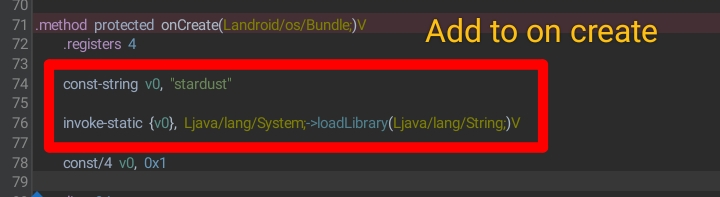

# UNITY_IMGUI
[](https://github.com/FlutterGenerator/UNITY_IMGUI/actions/workflows/build-apk.yml)



# Add To Main Activity OnCreate
```
    const-string v0, "stardust"
    
    invoke-static {v0}, Ljava/lang/System;->loadLibrary(Ljava/lang/String;)V
```

# Main Activity is Same for all unity games :
```
com / unity3d / player / unitPlayerActivity
```